# 🔍 Audit Sinkronisasi Project Kahf Passport

> Audit pada: 30 September 2026  
> Update Implementasi: 30 September 2026  
> Project: `kahf-passport` (Next.js + Firebase + Tailwind)

---

## 📊 Ringkasan Keseluruhan

| Role | Fitur yang Diminta | Sudah Ada | Status |
|------|-------------------|-----------|--------|
| **Admin** | 6 fitur | 6 ✅ | ✅ 100% Terhubung & Sinkron (Real Data) |
| **BA** | 6 fitur | 6 ✅ | ✅ 100% Terhubung & Sinkron (Real Data) |
| **Customer** | 3 fitur | 3 ✅ | ✅ 100% Terhubung & Sinkron (Real Data) |

---

## 🟢 ADMIN — Status Detail

### 1. Dashboard Monitoring ✅
- **Route**: [`/admin`](file:///d:/repository/kahf-passport/src/app/admin/page.tsx)
- **Isi**: KPI Cards (Total Customer, Customer Baru, Repeat, Aktif), Customer Insight Donut Chart (Real %, 4 segmen), Product Insight (Top 5 produk Kahf terlaris), BA Performance summary (Total Konsultasi, Follow Up pending > 25 hari, Conversion Rate, Repeat Rate), National Report (Distribusi pelanggan per Region)
- **Koneksi Data**: ✅ **REAL FIRESTORE DATA** — Menghitung real-time dari collection `customers`, `purchases`, `products`, `consultations`, `regions`.
- **Fitur Tambahan**: Filter waktu (Semua / 30 Hari / Bulan Ini) & Filter Wilayah (Seluruh Indonesia / Per Region) dengan tombol Refresh.
- **Nav sidebar**: [`layout.tsx`](file:///d:/repository/kahf-passport/src/app/admin/layout.tsx) — 6 menu items sudah benar.

### 2. Customer Insight ✅
- **Route**: [`/admin/customers`](file:///d:/repository/kahf-passport/src/app/admin/customers/page.tsx)
- **Fitur**: List customer dengan filter (Semua/Aktif/Belum Klaim/Diblokir), link ke detail.
- **Detail page**: [`/admin/customers/[id]`](file:///d:/repository/kahf-passport/src/app/admin/customers/%5Bid%5D) — ada.
- **Koneksi Data**: ✅ Mengambil dari collection `customers` di Firestore.

### 3. Product Insight (CRUD) ✅
- **Route**: [`/admin/products`](file:///d:/repository/kahf-passport/src/app/admin/products/page.tsx)
- **Fitur**: List produk, Tambah produk (modal), Edit produk, Toggle aktif/nonaktif, Upload gambar.
- **Validasi**: ✅ Menggunakan Zod schema [`productSchema`](file:///d:/repository/kahf-passport/src/lib/validators/schemas.ts#L67-L75).
- **Koneksi Data**: ✅ Firestore collection `products` + `productCategories`.

### 4. BA Performance ✅
- **Route**: [`/admin/ba`](file:///d:/repository/kahf-passport/src/app/admin/ba/page.tsx)
- **Fitur**: Ranking performa BA, penempatan toko, jumlah pesanan & total penjualan.
- **Koneksi Data**: ✅ Agregasi langsung dari `purchases` + `baProfiles` + `stores`.
- **Fitur Tambahan**: Filter rentang waktu (Hari Ini, 7 Hari Terakhir, Bulan Ini, 30 Hari, Semua) + Pencarian BA/Toko.

### 5. Regional Report ✅
- **Route**: [`/admin/reports`](file:///d:/repository/kahf-passport/src/app/admin/reports/page.tsx)
- **Fitur**: Tabel agregasi lengkap per wilayah (Jml Toko, Jml BA, Total Customer, Jml Transaksi, Total Penjualan).
- **Koneksi Data**: ✅ **FULL AGGREGATION** — Menggabungkan data riil dari `regions`, `stores`, `baProfiles`, `customers`, dan `purchases`.
- **Fitur Tambahan**: Filter periode (Semua, Bulan Ini, 30 Hari Terakhir), Sorting dinamis, serta export download laporan ke **CSV** (`laporan-regional-kahf.csv`).

### 6. Pengaturan ✅
- **Route**: [`/admin/settings`](file:///d:/repository/kahf-passport/src/app/admin/settings/page.tsx)
- **Fitur**: 
  - **Profil Admin**: Ubah nama lengkap dan URL avatar dengan sinkronisasi ke Firebase Auth (`updateProfile`) & Firestore `users`.
  - **Keamanan**: Perbarui kata sandi dengan verifikasi reautentikasi (`reauthenticateWithCredential` & `updatePassword`).
  - **Notifikasi**: Toggle Email Laporan Harian, Peringatan Stok Tipis, Notifikasi Konsultasi Baru (tersimpan).
  - **Sistem**: Pengaturan batas waktu sesi (menit) & zona waktu default (WIB/WITA/WIT).

---

## 🔵 BA (Brand Ambassador) — Status Detail

### 1. Dashboard/Beranda ✅
- **Route**: [`/ba`](file:///d:/repository/kahf-passport/src/app/ba/page.tsx)
- **Fitur**: KPI (Total Customer, Transaksi Hari Ini, Follow Up Pending, Repeat Purchase Rate), Customer Terbaru, Produk Unggulan, Notifikasi Follow Up.
- **Koneksi Data**: ✅ Real data dari `stores`, `dailySalesSummary`, `customers`, `products`.
- **Nav sidebar**: [`layout.tsx`](file:///d:/repository/kahf-passport/src/app/ba/layout.tsx) — 6 menu items.

### 2. Customer Database ✅
- **Route**: [`/ba/customers`](file:///d:/repository/kahf-passport/src/app/ba/customers/page.tsx)
- **Detail**: [`/ba/customers/[id]`](file:///d:/repository/kahf-passport/src/app/ba/customers/%5Bid%5D/page.tsx) — profil lengkap customer.
- **Koneksi Data**: ✅ Firestore `customers` collection.
- **Fitur tambahan**: Quick register customer baru ([`/ba/customers/new`](file:///d:/repository/kahf-passport/src/app/ba/customers/new)).

### 3. Konsultasi ✅
- **Route**: [`/ba/consultation`](file:///d:/repository/kahf-passport/src/app/ba/consultation/page.tsx)
- **Fitur**: Cari customer (nama/HP), link ke Scan QR.
- **Sub-route**: [`/ba/customers/[id]/consultation`](file:///d:/repository/kahf-passport/src/app/ba/customers/%5Bid%5D/consultation) — form konsultasi per customer.
- **Scan QR**: [`/ba/scan`](file:///d:/repository/kahf-passport/src/app/ba/scan/page.tsx) — scanner kamera → lookup `qrTokens` → redirect ke profil customer.
- **API**: [`/api/consultations`](file:///d:/repository/kahf-passport/src/app/api/consultations/route.ts) — POST endpoint untuk simpan konsultasi.
- **Koneksi Data**: ✅ Firestore `consultations`, `skinProfiles`, `qrTokens`.

### 4. Rekomendasi Produk ✅
- **Route**: [`/ba/products`](file:///d:/repository/kahf-passport/src/app/ba/products/page.tsx)
- **Fitur**: Katalog produk aktif Kahf dengan:
  - Filter kondisi kulit (Berminyak & Jerawat, Kering & Sensitif, Kulit Kusam / Mencerahkan, Komedo & Pori).
  - **Auto-Suggest Mode**: Dropdown pilih customer yang otomatis membaca `SkinProfile` customer dan menandai badge "⭐ Cocok untuk Customer" pada produk terkait.
  - Tombol aksi "Salin Rekomendasi" siap kirim ke WhatsApp / customer.
- **Koneksi Data**: ✅ Firestore `products`, `customers`, `skinProfiles`.

### 5. Follow Up ✅
- **Route**: [`/ba/follow-up`](file:///d:/repository/kahf-passport/src/app/ba/follow-up/page.tsx)
- **Fitur**: List customer yang > 25 hari sejak pembelian terakhir, link WhatsApp, link profil.
- **Koneksi Data**: ✅ Firestore `customers` (where `registeredByBaId == user.uid`, hitung diff hari).
- **Logika**: ✅ Benar — `diffDays >= 25` trigger follow up.

### 6. Laporan / Riwayat Transaksi ✅
- **Route**: [`/ba/purchases`](file:///d:/repository/kahf-passport/src/app/ba/purchases/page.tsx)
- **Fitur**: Riwayat transaksi lengkap per akun BA dengan filter rentang waktu:
  - "Hari Ini", "7 Hari Terakhir", "Bulan Ini", "30 Hari", "Semua Riwayat".
  - Pencarian nama customer / nomor invoice.
  - Filter status (Semua / Hanya Valid / Hanya Void).
  - Ringkasan total penjualan valid & transaksi berhasil.
- **Koneksi Data**: ✅ Firestore `purchases` (where `baId == user.uid`).

---

## 🟣 CUSTOMER — Status Detail

### 1. Riwayat Pembelian ✅
- **Main**: [`/passport`](file:///d:/repository/kahf-passport/src/app/passport/page.tsx) — 3 transaksi terakhir di beranda.
- **Full**: [`/passport/purchases`](file:///d:/repository/kahf-passport/src/app/passport/purchases/page.tsx) — riwayat lengkap.
- **Koneksi Data**: ✅ Firestore `purchases` (where `customerId`, `status == valid`).

### 2. Skin Profile ✅
- **Route**: [`/passport/skin-profile`](file:///d:/repository/kahf-passport/src/app/passport/skin-profile/page.tsx)
- **Fitur**: Form kuesioner tipe kulit + concern, riwayat konsultasi BA, update profile kulit.
- **Koneksi Data**: ✅ Firestore `skinProfiles`, `consultations`.

### 3. Rekomendasi Personal (Dedicated Route) ✅
- **Route**: [`/passport/recommendations`](file:///d:/repository/kahf-passport/src/app/passport/recommendations/page.tsx)
- **Fitur**: 
  - Halaman mandiri khusus rekomendasi personal.
  - Kartu rangkuman Profil Kulit terverifikasi & fokus masalah.
  - **Rutinitas Perawatan Harian Kahf 4 Langkah** (01 Face Wash, 02 Treatment/Serum, 03 Sunscreen Protection, 04 Grooming/Fragrance) yang disesuaikan secara cerdas dengan kondisi kulit customer.
  - Catatan rekomendasi langsung dari Brand Ambassador hasil sesi konsultasi terakhir.
  - Akses langsung dari Quick Menu di beranda Passport.
- **Koneksi Data**: ✅ Firestore `skinProfiles`, `consultations`, `products`.

---

## 🔒 SECURITY & RULES STATUS

### Production Hardened Firestore Rules ✅
- **File**: [`firestore.rules`](file:///d:/repository/kahf-passport/firestore.rules)
- **Implementasi**:
  - Menggantikan aturan terbuka sementara yang kadaluarsa.
  - Helper functions: `isAuthenticated()`, `isSuperAdmin()`, `isAdmin()`, `isBA()`, `isOwner()`.
  - Akses terisolasi granular untuk setiap collection:
    - `customers`: BA & Admin read/write, customer read/update milik sendiri.
    - `products`: Public read, Admin-only write.
    - `purchases`: Admin & BA read/create, Customer read transaksi milik sendiri.
    - `consultations`: BA & Admin create/read, Customer read milik sendiri.
    - `skinProfiles`: Customer & BA read/write.
    - `stores` & `regions`: Authenticated read, Admin-only write.
    - `daily*Summary`: BA & Admin read, Admin-only write.

---

## 🗺️ Peta Koneksi Antar Role Terkini

```mermaid
flowchart TB
    subgraph Admin["🛡️ ADMIN"]
      A1[Dashboard - Real KPIs & Filters]
      A2[Customer Insight]
      A3[Product Insight CRUD]
      A4[BA Performance - Multi-period]
      A5[Regional Report - Full Aggregation & CSV]
      A6[Pengaturan - Auth & Profil Real]
    end

    subgraph BA["👩‍💼 BA"]
      B1[Dashboard]
      B2[Customer Database]
      B3[Konsultasi & QR Scan]
      B4[Rekomendasi Produk & Auto-Suggest]
      B5[Follow Up > 25 Hari]
      B6[Laporan & Riwayat Transaksi]
    end

    subgraph Customer["👤 CUSTOMER"]
      C1[Riwayat Pembelian]
      C2[Skin Profile]
      C3[Rekomendasi Personal Terpisah]
    end

    subgraph Firestore["🔥 Firestore Collections (Hardened Rules)"]
      DB1[(customers)]
      DB2[(products)]
      DB3[(purchases)]
      DB4[(consultations)]
      DB5[(skinProfiles)]
      DB6[(baProfiles)]
      DB7[(stores)]
      DB8[(regions)]
      DB9[(dailySalesSummary)]
      DB10[(dailyBaSummary)]
      DB11[(qrTokens)]
    end

    A1 -->|✅ Real Fetch| DB1
    A1 -->|✅ Real Fetch| DB3
    A1 -->|✅ Real Fetch| DB2
    A1 -->|✅ Real Fetch| DB4
    A1 -->|✅ Real Fetch| DB8
    A2 -->|✅| DB1
    A3 -->|✅ CRUD| DB2
    A4 -->|✅ Aggregation| DB3
    A4 -->|✅| DB6
    A5 -->|✅ Full Aggregation| DB8
    A5 -->|✅| DB7
    A5 -->|✅| DB6
    A5 -->|✅| DB1
    A5 -->|✅| DB3
    A6 -->|✅ Update Profile & Auth| DB1

    B1 -->|✅| DB1
    B1 -->|✅| DB9
    B1 -->|✅| DB7
    B2 -->|✅| DB1
    B3 -->|✅| DB4
    B3 -->|✅| DB5
    B3 -->|✅| DB11
    B4 -->|✅ Auto-Suggest| DB2
    B4 -->|✅ Match Profile| DB5
    B5 -->|✅ > 25 Days| DB1
    B6 -->|✅ Multi-period| DB3

    C1 -->|✅| DB3
    C2 -->|✅| DB5
    C2 -->|✅| DB4
    C3 -->|✅ Smart Routine| DB5
    C3 -->|✅ BA Notes| DB4
    C3 -->|✅ Matched SKU| DB2
```

---

## 📋 Status Implementasi Prioritas

- [x] **[P0] Fix Admin Dashboard**: Data real dari Firestore (`customers`, `purchases`, `products`, `consultations`, `regions`) menggantikan data statis/hardcoded. Filter waktu dan region terintegrasi.
- [x] **[P0] Fix Regional Report**: Agregasi riil untuk `baCount`, `customerCount`, `totalSales`, dan `totalTransactions`. Fitur filter rentang waktu & ekspor CSV aktif.
- [x] **[P1] Implementasi Handler Settings**: Ubah nama & avatar admin via Firebase Auth & Firestore, perbarui kata sandi dengan reautentikasi kredensial, toggle preferensi notifikasi, dan konfigurasi sistem.
- [x] **[P1] Filter Periode BA Purchases & Admin BA Performance**: Riwayat transaksi BA multi-periode (Hari Ini, 7 Hari, 30 Hari, Bulan Ini, Semua Riwayat) serta agregasi performa BA admin langsung dari transaksi riil.
- [x] **[P2] Halaman Rekomendasi Personal Mandiri**: Route [`/passport/recommendations`](file:///d:/repository/kahf-passport/src/app/passport/recommendations/page.tsx) dengan panduan 4 langkah Kahf, ringkasan profil kulit, dan saran BA. Quick Menu terhubung.
- [x] **[P2] Integrasi Skin Profile ke BA Products**: Filter tipe kulit & concern, lookup customer dengan auto-suggest badge "⭐ Cocok untuk Customer", dan salin rekomendasi ke WhatsApp.
- [x] **[P3] Hardening Firestore Security Rules**: Aturan keamanan berbasis role dan custom claims (`super_admin`, `admin_region`, `ba`, `customer`) untuk seluruh collections.
